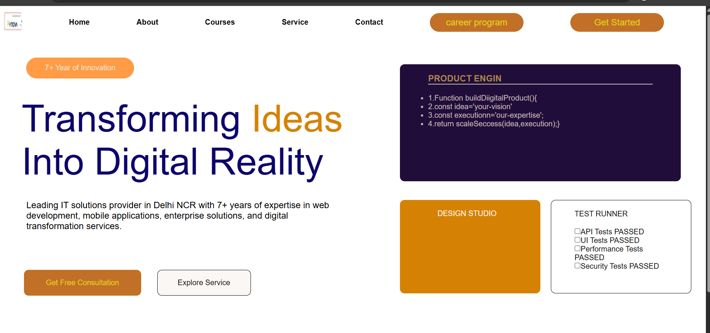

##output

# Rynova Website Clone

This project is a clone of the Ynova website created during a college workshop.

## Features
- Navigation bar
- Login/Register page
- Simple UI design

## Technologies Used
- HTML
- CSS

## What I Learned
- Basic website structure
- Styling using CSS
- How to use GitHub

## Live Demo
(Add your GitHub Pages link here)

## Note
This project is made for learning purposes.
